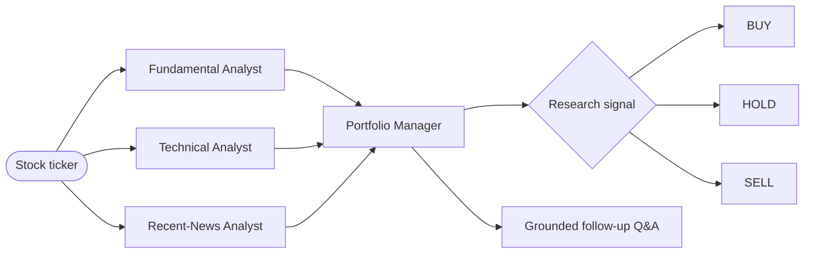

<div align="center">

# GLM Stock Swarm

### Four AI research agents. One evidence-based stock report. Right in your terminal.

[](https://www.python.org/)
[](https://docs.astral.sh/uv/)
[](https://docs.z.ai/guides/vlm/glm-5.3-flash)
[](https://www.crewai.com/)
[](https://textual.textualize.io/)
[](#testing)
[](LICENSE)

GLM-5.3-Flash and CrewAI coordinate fundamental, technical, and recent-news
specialists before a portfolio manager produces a sourced `BUY`, `HOLD`, or `SELL`
research signal.

</div>

<p align="center">
  
</p>

> [!CAUTION]
> **Research only—not financial advice.** Model output and third-party data can be incomplete, delayed, or wrong. Never trade solely from this application.

## Why GLM Stock Swarm?

- **Four focused agents** instead of one oversized prompt.
- **Real market evidence** from Finnhub and recent-news research from Tavily.
- **Deterministic indicators** calculated locally with pandas and NumPy.
- **Grounded follow-ups** answered only from the completed research report.
- **Fast local workflow** through a compact, keyboard-friendly Textual interface.
- **Reproducible setup** with uv, Python 3.13, and a committed lockfile.

## How it works



The CrewAI workflow runs sequentially so the portfolio manager receives the three
specialist reports as explicit context. It weighs both bullish and bearish evidence,
reports missing data, and uses `HOLD` when the evidence is mixed.

## Quick start

### 1. Configure the APIs

The environment variables have already been added in the tested local setup. For a
new installation, create keys with each provider:

| Provider | Free access for getting started |
|:--|:--|
| [**Finnhub**](https://finnhub.io/pricing) | Free plan with US coverage and up to 60 API calls per minute |
| [**Tavily**](https://docs.tavily.com/documentation/api-credits) | 1,000 free API credits every month; no credit card required |
| [**Z.ai**](https://docs.z.ai/guides/overview/quick-start) | New accounts may receive a small promotional balance for initial API tests, but availability and amount can vary |

> [!TIP]
> Finnhub and Tavily's free plans are normally enough to try this project. Z.ai's starter credit is much more limited because one stock analysis invokes four agents; it may run out after only a few end-to-end tests.

#### Create a local `.env` file

This is the easiest persistent setup. Copy the included template:

```powershell
Copy-Item .env.example .env
```

On macOS or Linux:

```bash
cp .env.example .env
```

Open `.env` and replace the placeholders:

```dotenv
ZAI_API_KEY=your_standard_zai_api_key
FINNHUB_API_KEY=your_finnhub_api_key
TAVILY_API_KEY=your_tavily_api_key
```

The app loads `.env` automatically. The file is ignored by Git; `.env.example`
contains placeholders only and is safe to commit.

> [!IMPORTANT]
> Z.ai's limited starter balance is useful for testing, but a four-agent analysis consumes it quickly. After the first few tests, add at least **$3 of standard API credit** from the [Z.ai billing page](https://z.ai/manage-apikey/billing). The app calls `https://api.z.ai/api/paas/v4/` with `glm-5.3-flash`.

> [!WARNING]
> Do **not** use a GLM Coding Plan key or the `/coding/paas/v4` endpoint. Coding Plan quota is limited to supported coding tools and does not cover this stock-analysis workload.

> [!CAUTION]
> Never paste real API keys into source files, the notebook, screenshots, issues, or commits. If a key is exposed, revoke it at the provider immediately.

### 2. Install

This repository uses [uv](https://docs.astral.sh/uv/) for Python, dependency locking,
installation, and commands. From the project directory:

```powershell
uv sync
```

`uv` reuses the existing `.venv`; you do not need to activate it manually.

### 3. Launch the TUI

```powershell
uv run glm-stock-swarm
```

Enter a ticker, select **Analyze**, and watch the agent progress rail move through
fundamentals, technicals, news, and the final decision. After the report completes,
use the lower input to ask a grounded follow-up question.

| Shortcut | Action |
|:--|:--|
| `Ctrl+R` | Analyze the current ticker |
| `Ctrl+L` | Clear the report |
| `Ctrl+Q` | Quit |
| `Ctrl+P` | Open the command palette |

## Data and model pipeline

| Component | Responsibility |
|:--|:--|
| **Finnhub** | Quotes and company fundamentals |
| **Yahoo chart response** | Daily-price fallback when Finnhub candles are unavailable |
| **pandas + NumPy** | SMA20/50/200, RSI14, MACD, returns, and trend calculations |
| **Tavily** | Material recent news, dates, and source links |
| **GLM-5.3-Flash** | Specialist interpretation, synthesis, and report-grounded Q&A |
| **CrewAI** | Sequential agent and task orchestration |

## Jupyter notebook

Prefer an inspectable, cell-by-cell workflow? Launch the included notebook in the
same locked environment:

```powershell
uv run jupyter notebook stock_analyst_crew.ipynb
```

It defaults to `NVDA`. Set `STOCK_TICKER` before launching Jupyter to analyze another
symbol.

## Project layout

```text
glm-stock-swarm/
├── tui.py                      # Compact interactive terminal interface
├── stock_swarm.py              # Agents, tools, data collection, and GLM client
├── stock_analyst_crew.ipynb    # Guided notebook workflow
├── pyproject.toml              # Project metadata and pinned direct dependencies
├── uv.lock                     # Reproducible dependency graph
└── tests/test_app.py           # Core and Textual integration tests
```

## Updating dependencies

Upgrade the lockfile intentionally, then synchronize the existing `.venv`:

```powershell
uv lock --upgrade
uv sync
```

## Testing

```powershell
uv run python -m unittest discover -s tests -v
```

The suite verifies ticker validation, technical indicators, safe billing errors, the
fixed standard Z.ai endpoint, CrewAI retry behavior, and the interactive TUI flow.

## Troubleshooting

<details>
<summary><strong>Z.ai returns HTTP 429 / code 1113</strong></summary>

The standard API account has insufficient credit or no eligible resource package.
Add at least $3 of standard API credit, then retry. Coding Plan credit cannot be used
for this app.

</details>

<details>
<summary><strong>The TUI reports a missing environment variable</strong></summary>

Confirm that `ZAI_API_KEY`, `FINNHUB_API_KEY`, and `TAVILY_API_KEY` exist in the same
terminal session that launches `uv run glm-stock-swarm`, or place them in a local
`.env` file.

</details>

<details>
<summary><strong>Finnhub daily candles are unavailable</strong></summary>

The application automatically falls back to Yahoo's public chart response for daily
prices. Finnhub is still used for live quotes and company fundamentals.

</details>

## References

- [Finnhub pricing and free plan](https://finnhub.io/pricing)
- [Tavily API credits and pricing](https://docs.tavily.com/documentation/api-credits)
- [GLM-5.3-Flash overview](https://docs.z.ai/guides/vlm/glm-5.3-flash)
- [Z.ai standard API pricing](https://docs.z.ai/guides/overview/pricing)
- [Z.ai API billing](https://z.ai/manage-apikey/billing)
- [GLM Coding Plan quick start](https://docs.z.ai/devpack/quick-start)
- [Z.ai supported-tool policy](https://docs.z.ai/devpack/tool/others)
- [uv documentation](https://docs.astral.sh/uv/)
- [CrewAI documentation](https://docs.crewai.com/)
- [Textual documentation](https://textual.textualize.io/)

## License

Released under the [MIT License](LICENSE).
