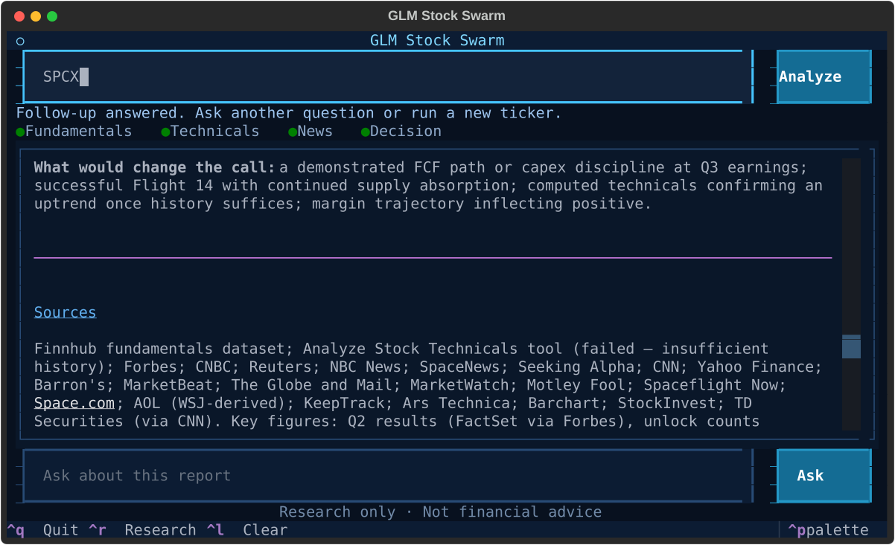

<div align="center">

# GLM Stock Swarm

### Four AI research agents. One evidence-based stock report. Right in your terminal.

[](https://www.python.org/)
[](https://docs.astral.sh/uv/)
[](https://docs.z.ai/guides/vlm/glm-5.3-flash)
[](https://www.crewai.com/)
[](https://textual.textualize.io/)
[](#testing)
[](LICENSE)

GLM-5.3-Flash and CrewAI coordinate fundamental, technical, and recent-news
specialists before a portfolio manager produces a sourced `BUY`, `HOLD`, or `SELL`
research signal.

</div>

<p align="center">
  
</p>

> [!CAUTION]
> **Research only, not financial advice.** Model output and third-party data can be incomplete, delayed, or wrong. Never trade solely from this application.

## Why GLM Stock Swarm?

- **Four focused agents** for fundamentals, technicals, news, and synthesis.
- **Real evidence** from market APIs plus locally calculated indicators.
- **Grounded follow-ups** constrained to the completed report.
- **Compact and reproducible** with Textual, uv, and Python 3.13.

## How it works


CrewAI runs the specialists sequentially, then gives their reports to the portfolio
manager for a balanced decision. Missing data is disclosed, and mixed evidence
defaults to `HOLD`.

## Quick start

### 1. Configure the APIs

The environment variables have already been added in the tested local setup. For a
new installation, create keys with each provider:

| Provider | Free access for getting started |
|:--|:--|
| [**Finnhub**](https://finnhub.io/pricing) | Free plan with US coverage and up to 60 API calls per minute |
| [**Tavily**](https://docs.tavily.com/documentation/api-credits) | 1,000 free API credits every month; no credit card required |
| [**Z.ai**](https://docs.z.ai/guides/overview/quick-start) | Limited promotional credit may be available for initial tests; availability varies |

#### Create a local `.env` file

This is the easiest persistent setup. Copy the included template:

```powershell
Copy-Item .env.example .env
```

On macOS or Linux:

```bash
cp .env.example .env
```

Open `.env` and replace the placeholders:

```dotenv
ZAI_API_KEY=your_standard_zai_api_key
FINNHUB_API_KEY=your_finnhub_api_key
TAVILY_API_KEY=your_tavily_api_key
```

The app loads `.env` automatically. The file is ignored by Git; `.env.example`
contains placeholders only and is safe to commit.

> [!IMPORTANT]
> Each analysis invokes four agents, so Z.ai's starter credit may last only a few tests. Add at least **$3 of standard API credit** from the [billing page](https://z.ai/manage-apikey/billing). This app uses `glm-5.3-flash` through `https://api.z.ai/api/paas/v4/`.

> [!WARNING]
> Do **not** use a [GLM Coding Plan](https://docs.z.ai/devpack/tool/others) key or `/coding/paas/v4`; that quota does not cover this application.

> [!CAUTION]
> Never paste real API keys into source files, the notebook, screenshots, issues, or commits. If a key is exposed, revoke it at the provider immediately.

### 2. Install

Install the locked environment with [uv](https://docs.astral.sh/uv/):

```powershell
uv sync
```

`uv` creates or reuses `.venv`; manual activation is unnecessary.

### 3. Launch the TUI

```powershell
uv run glm-stock-swarm
```

Enter a ticker, select **Analyze**, and watch the agent progress rail move through
fundamentals, technicals, news, and the final decision. After the report completes,
use the lower input to ask a grounded follow-up question.

| Shortcut | Action |
|:--|:--|
| `Ctrl+R` | Analyze the current ticker |
| `Ctrl+L` | Clear the report |
| `Ctrl+Q` | Quit |
| `Ctrl+P` | Open the command palette |

## Data and model pipeline

| Component | Responsibility |
|:--|:--|
| **Finnhub** | Current quotes and company fundamentals |
| **Yahoo public chart** | Daily prices used for technical indicators |
| **pandas + NumPy** | SMA20/50/200, RSI14, MACD, returns, and trend calculations |
| **Tavily** | Material recent news, dates, and source links |
| **GLM-5.3-Flash** | Specialist interpretation, synthesis, and report-grounded Q&A |
| **CrewAI** | Sequential agent and task orchestration |

## Jupyter notebook

Prefer an inspectable, cell-by-cell workflow? Launch the included notebook in the
same locked environment:

```powershell
uv run jupyter notebook stock_analyst_crew.ipynb
```

It defaults to `NVDA`. Set `STOCK_TICKER` before launching Jupyter to analyze another
symbol.

## Project layout

```text
glm-stock-swarm/
├── tui.py                      # Compact interactive terminal interface
├── stock_swarm.py              # Agents, tools, data collection, and GLM client
├── stock_analyst_crew.ipynb    # Guided notebook workflow
├── pyproject.toml              # Project metadata and pinned direct dependencies
├── uv.lock                     # Reproducible dependency graph
├── LICENSE                     # Apache License 2.0 terms
└── tests/test_app.py           # Core and Textual integration tests
```

## Updating dependencies

Upgrade the lockfile intentionally, then synchronize the existing `.venv`:

```powershell
uv lock --upgrade
uv sync
```

## Testing

```powershell
uv run python -m unittest discover -s tests -v
```

## License

Licensed under the [Apache License 2.0](LICENSE).
